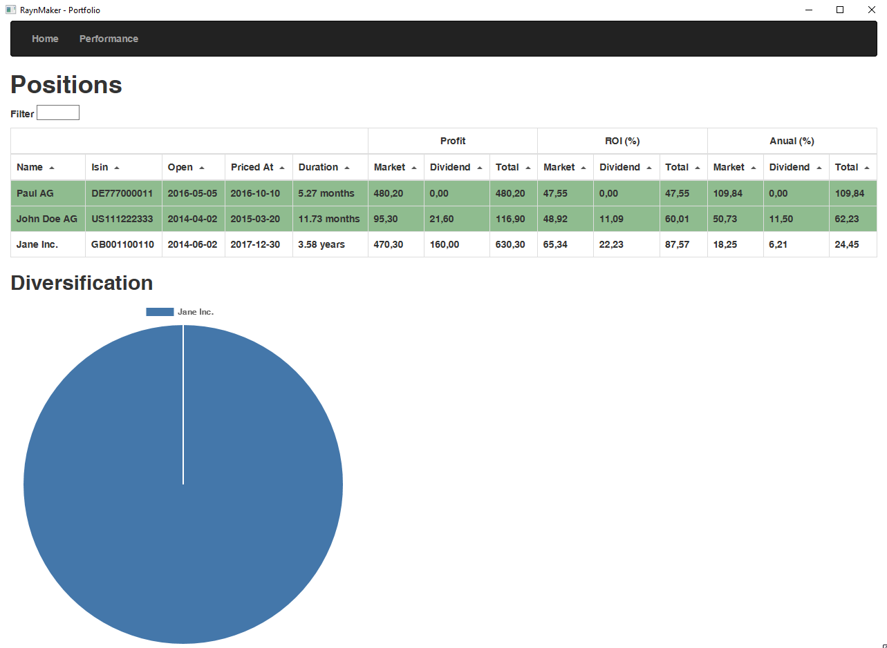

### Backend Documentation:

#### 1. Installation:
- To run the backend portion of this project, make sure you have .NET Core 3.x installed.

#### 2. Configuration Changes:
- A modification was made to the HTTP binding to allow connections from different hosts. The change was made from `IPAddress.Loopback` to `IPAddress.Any`. This adjustment enables the backend to accept connections from various hosts.

#### 3. Dockerization:
- A Docker image for the backend was created using the multi-stage build concept. This allows for a streamlined and optimized image for deployment.

#### 4. File Exclusions:
- Git and Docker ignore files were configured to exclude unnecessary files from the Docker image. This helps keep the image size minimal and efficient.

### Frontend Documentation:

#### 1. Folder Relocation:
- The "packages/Googleplattle" folder was initially located outside the frontend folder. It was moved inside the frontend folder to ensure it is included in the Docker image and can be used as part of the frontend application.

#### 2. Error Handling:
- In the "palette.js" file, there were several warnings and errors. These issues were addressed by configuring an `.eslintrc.json` file to ignore specific lines. This approach allows the project to build and run successfully even with these warnings.

### Docker Compose:
- A Docker Compose file was created to orchestrate the deployment of the entire application. However, there is an issue with the `System.Console.In.Read() |> ignore` line in the backend code, which generates an error during the Docker Compose process. It is recommended to consult with a developer or an experienced person to review and modify this line while preserving the intended functionality.

RaynMaker.Portfolio manages your portfolio performance. 
RaynMaker.Portfolio provides the transparency you need to track your open positions and 
measure your performance.

- [Getting Started](docs/GettingStarted/ReadMe.md)
- [Contributions](docs/Development.md)

